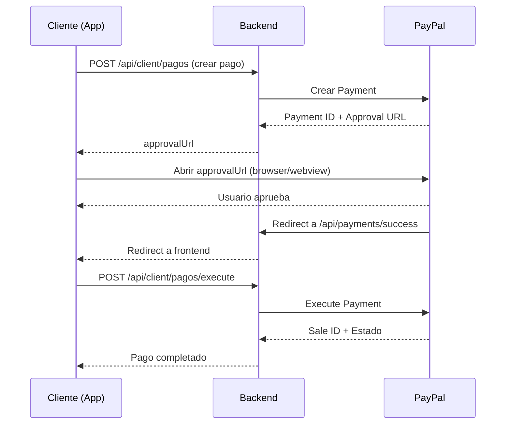

# Módulo de Pagos con PayPal

## 📋 Descripción General

El módulo de pagos permite procesar pagos de reservas a través de PayPal como pasarela de pago. Implementa una arquitectura hexagonal con separación de responsabilidades entre CLIENT y OWNER.

## 🏗️ Arquitectura

```
payment/
├── adapters/
│   ├── in/
│   │   └── web/
│   │       ├── PagoClientController.java
│   │       ├── PagoOwnerController.java
│   │       └── PaymentCallbackController.java
│   └── out/
│       └── persistence/
│           ├── PagoRepository.java
│           └── PagoRepositoryAdapter.java
├── application/
│   ├── dto/
│   │   ├── CrearPagoReservaRequest.java
│   │   ├── PagoResponse.java
│   │   └── PaymentExecutionResponse.java
│   └── service/
│       ├── PagoClientService.java
│       ├── PagoOwnerService.java
│       └── PayPalService.java
├── config/
│   └── PayPalConfig.java
└── domain/
    ├── exception/
    │   ├── PagoNotFoundException.java
    │   ├── PagoAccessDeniedException.java
    │   ├── PagoYaExisteException.java
    │   └── PaymentProcessException.java
    └── port/
        └── out/
            └── PagoRepositoryPort.java
```

## 🔐 Configuración de PayPal

### 1. Obtener Credenciales de PayPal

1. Ve a [PayPal Developer Dashboard](https://developer.paypal.com/dashboard/)
2. Crea una aplicación (App) en "My Apps & Credentials"
3. Obtén el **Client ID** y **Secret**
4. Usa el modo "Sandbox" para pruebas

### 2. Variables de Entorno

Configura en tu archivo `.env` o `application.properties`:

```properties
# PayPal Configuration
PAYPAL_MODE=sandbox
PAYPAL_CLIENT_ID=tu-client-id-aqui
PAYPAL_CLIENT_SECRET=tu-client-secret-aqui
PAYPAL_SUCCESS_URL=http://localhost:8080/api/payments/success
PAYPAL_CANCEL_URL=http://localhost:8080/api/payments/cancel

# Frontend URL para redirecciones
APP_FRONTEND_URL=http://localhost:3000
```

## 📊 Modelo de Datos

### Entidad Pago

```java
@Entity
@Table(name = "pagos")
public class Pago extends SoftDeletableEntity {
    private Long id;
    private Empresa empresa;
    private Suscripcion suscripcion;    // Opcional
    private Reserva reserva;            // Opcional
    private BigDecimal monto;
    private String moneda;              // USD, EUR, COP, etc.
    private MetodoPago metodoPago;      // PAYPAL, TARJETA_CREDITO, etc.
    private EstadoPago estado;          // PENDIENTE, COMPLETADO, etc.
    private String paypalPaymentId;
    private String paypalPayerId;
    private String paypalSaleId;
    private String descripcion;
    private LocalDateTime fechaPago;
    private LocalDateTime fechaCreacion;
    private String notas;
}
```

### Enums

```java
public enum MetodoPago {
    PAYPAL, TARJETA_CREDITO, TARJETA_DEBITO, EFECTIVO, TRANSFERENCIA
}

public enum EstadoPago {
    PENDIENTE, PROCESANDO, COMPLETADO, FALLIDO, CANCELADO, REEMBOLSADO, EXPIRADO
}
```

## 🔌 API Endpoints

### Para CLIENTES (CLIENT)

#### 1. Crear Pago
```http
POST /api/client/pagos
Authorization: Bearer {jwt-token}
Content-Type: application/json

{
  "reservaId": 1,
  "monto": 25.50,
  "moneda": "USD",
  "descripcion": "Corte de cabello"
}
```

**Response:**
```json
{
  "success": true,
  "message": "Pago creado exitosamente. Redirige al usuario a la URL de aprobación.",
  "data": {
    "id": 1,
    "reservaId": 1,
    "monto": 25.50,
    "moneda": "USD",
    "estado": "PENDIENTE",
    "paypalPaymentId": "PAYID-123456",
    "approvalUrl": "https://www.sandbox.paypal.com/checkoutnow?token=EC-xxxxx",
    "fechaCreacion": "2025-11-03T16:30:00"
  }
}
```

#### 2. Ejecutar Pago (después de aprobación)
```http
POST /api/client/pagos/execute?paymentId=PAYID-123456&PayerID=PAYER123
Authorization: Bearer {jwt-token}
```

**Response:**
```json
{
  "success": true,
  "message": "Pago completado exitosamente",
  "data": {
    "pagoId": 1,
    "estado": "COMPLETADO",
    "mensaje": "Pago completado exitosamente",
    "paypalSaleId": "SALE-123456"
  }
}
```

#### 3. Listar Mis Pagos
```http
GET /api/client/pagos
Authorization: Bearer {jwt-token}
```

#### 4. Obtener Pago por ID
```http
GET /api/client/pagos/{id}
Authorization: Bearer {jwt-token}
```

#### 5. Obtener Pago de una Reserva
```http
GET /api/client/pagos/reserva/{reservaId}
Authorization: Bearer {jwt-token}
```

#### 6. Cancelar Pago Pendiente
```http
DELETE /api/client/pagos/{id}
Authorization: Bearer {jwt-token}
```

### Para DUEÑOS (OWNER)

#### 1. Listar Todos los Pagos
```http
GET /api/owner/pagos
Authorization: Bearer {jwt-token}
```

#### 2. Listar Pagos Paginados
```http
GET /api/owner/pagos/paginados?page=0&size=20&sort=fechaCreacion,desc
Authorization: Bearer {jwt-token}
```

#### 3. Listar Pagos por Estado
```http
GET /api/owner/pagos/estado/COMPLETADO
Authorization: Bearer {jwt-token}
```

Estados válidos: `PENDIENTE`, `COMPLETADO`, `FALLIDO`, `CANCELADO`, `REEMBOLSADO`

#### 4. Obtener Estadísticas
```http
GET /api/owner/pagos/estadisticas
Authorization: Bearer {jwt-token}
```

**Response:**
```json
{
  "success": true,
  "data": {
    "totalPagos": 150,
    "pagosCompletados": 120,
    "pagosPendientes": 5,
    "pagosFallidos": 10,
    "pagosCancelados": 15,
    "totalIngresos": 3500.00,
    "promedioMonto": 29.17
  }
}
```

#### 5. Obtener Pago por ID
```http
GET /api/owner/pagos/{id}
Authorization: Bearer {jwt-token}
```

#### 6. Eliminar Pago
```http
DELETE /api/owner/pagos/{id}
Authorization: Bearer {jwt-token}
```

### Callbacks Públicos (PayPal)

Estos endpoints son llamados automáticamente por PayPal:

#### Success Callback
```http
GET /api/payments/success?paymentId=xxx&PayerID=xxx&reservaId=xxx
```
Redirige al frontend: `{FRONTEND_URL}/payment/success?...`

#### Cancel Callback
```http
GET /api/payments/cancel?token=xxx&reservaId=xxx
```
Redirige al frontend: `{FRONTEND_URL}/payment/cancel?...`

## 🔄 Flujo de Pago



## 🧪 Pruebas con PayPal Sandbox

### 1. Crear Cuentas de Prueba

En PayPal Developer Dashboard:
- Ve a "Sandbox" → "Accounts"
- Crea cuentas de prueba (Personal y Business)

### 2. Usuarios de Prueba

PayPal proporciona usuarios de prueba:
- **Email**: sb-xxxxx@personal.example.com
- **Password**: (proporcionado por PayPal)

### 3. Tarjetas de Prueba

Puedes usar estas tarjetas en sandbox:
- **Visa**: 4032039769184576
- **Mastercard**: 5425233430109903
- **CVV**: cualquiera (123)
- **Fecha de expiración**: cualquier fecha futura

## 💡 Ejemplos de Uso

### Ejemplo en JavaScript (React Native / Expo)

```javascript
// 1. Crear pago
const crearPago = async (reservaId, monto) => {
  const response = await fetch('http://localhost:8080/api/client/pagos', {
    method: 'POST',
    headers: {
      'Authorization': `Bearer ${token}`,
      'Content-Type': 'application/json'
    },
    body: JSON.stringify({
      reservaId: reservaId,
      monto: monto,
      moneda: 'USD',
      descripcion: 'Pago de reserva'
    })
  });
  
  const data = await response.json();
  
  // Abrir URL de PayPal en webview o browser
  Linking.openURL(data.data.approvalUrl);
};

// 2. Ejecutar pago (después de callback)
const ejecutarPago = async (paymentId, payerId) => {
  const response = await fetch(
    `http://localhost:8080/api/client/pagos/execute?paymentId=${paymentId}&PayerID=${payerId}`,
    {
      method: 'POST',
      headers: {
        'Authorization': `Bearer ${token}`
      }
    }
  );
  
  const result = await response.json();
  
  if (result.success) {
    Alert.alert('Éxito', 'Pago completado correctamente');
  }
};
```

## ⚠️ Consideraciones de Seguridad

1. **Nunca expongas** las credenciales de PayPal en el frontend
2. **Valida** siempre que la reserva pertenece al usuario autenticado
3. **Verifica** el estado del pago antes de marcar servicios como pagados
4. **Implementa** webhooks de PayPal para notificaciones asíncronas (futuro)
5. **Usa HTTPS** en producción

## 🚀 Modo Producción

Para pasar a producción:

1. Cambia `PAYPAL_MODE=live`
2. Usa credenciales de producción (no sandbox)
3. Actualiza las URLs de callback a tu dominio real
4. Configura webhooks de PayPal para notificaciones
5. Implementa logs y monitoreo de transacciones

## 📝 Migraciones de Base de Datos

No olvides crear/actualizar la tabla `pagos`:

```sql
CREATE TABLE pagos (
    id BIGSERIAL PRIMARY KEY,
    reserva_id BIGINT REFERENCES reservas(id),
    suscripcion_id BIGINT REFERENCES suscripciones(id),
    empresa_id BIGINT NOT NULL REFERENCES empresas(id),
    monto DECIMAL(10, 2) NOT NULL,
    moneda VARCHAR(3) NOT NULL DEFAULT 'USD',
    metodo_pago VARCHAR(20) NOT NULL,
    estado VARCHAR(20) NOT NULL,
    paypal_payment_id VARCHAR(255) UNIQUE,
    paypal_payer_id VARCHAR(255),
    paypal_sale_id VARCHAR(255),
    descripcion VARCHAR(500),
    fecha_pago TIMESTAMP,
    fecha_creacion TIMESTAMP NOT NULL DEFAULT CURRENT_TIMESTAMP,
    notas VARCHAR(1000),
    deleted BOOLEAN DEFAULT FALSE,
    deleted_at TIMESTAMP,
    deleted_by VARCHAR(255)
);

CREATE INDEX idx_pagos_reserva ON pagos(reserva_id);
CREATE INDEX idx_pagos_empresa ON pagos(empresa_id);
CREATE INDEX idx_pagos_estado ON pagos(estado);
CREATE INDEX idx_pagos_paypal_payment ON pagos(paypal_payment_id);
```

## 🔗 Referencias

- [PayPal REST API Documentation](https://developer.paypal.com/docs/api/overview/)
- [PayPal SDK for Java](https://github.com/paypal/PayPal-Java-SDK)
- [PayPal Sandbox Testing Guide](https://developer.paypal.com/docs/api-basics/sandbox/)

## 📞 Soporte

Para problemas con la integración de PayPal, consulta:
- [PayPal Developer Support](https://www.paypal-community.com/t5/Developer-Support/ct-p/developer-support)
- Logs del servidor en `logs/payment.log`
